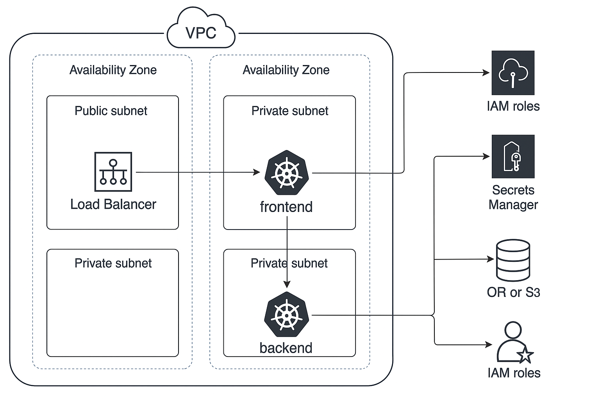

# OnFinance AI - Assignment

This project contains the implementation for the OnFinance AI Implementation Engineer assignment. It includes infrastructure automation using Terraform, Kubernetes deployment on AWS EKS, logging & monitoring setup, and external API integration.

---

## 🌐 Architecture Overview

The architecture is designed to be:
- **Scalable** and **highly available** (multi-AZ deployment)
- **Secure** (IAM roles, private subnets, Secrets Manager)
- **Monitorable** (CloudWatch logs and metrics)



---

## 📁 Project Structure

```bash
terraform/
├── main.tf
├── variables.tf
├── outputs.tf
├── modules/
│   ├── vpc/
│   ├── eks/
│   └── iam/
├── terraform.tfvars
└── README.md

